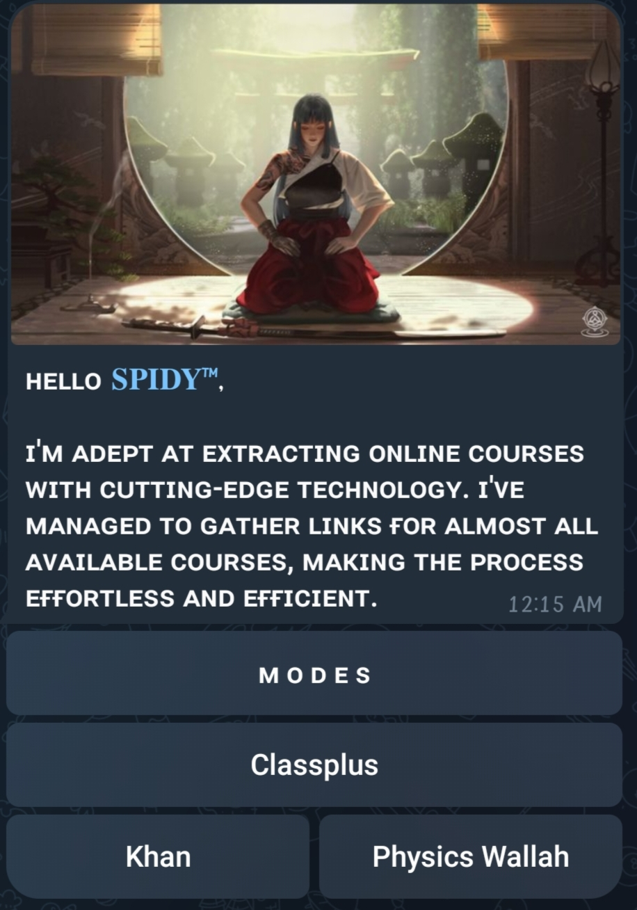

<p align="center">
  <a href="https://t.me/spidy-bots">
    
  </a>
</p>

<h1 align="center">
  
</h1>

---

### ⚙️ Features
- Extracts Txt from **AppxV2 & AppxV3** platforms
- Supports **Khan GS**, **ClassPlus**, and **PW (PhysicsWallah)**
- Token-based and login-based extraction supported
- Clean UI with Telegram buttons (use `/start` to begin)
- Admin-only premium controls available in `modules/`

---

### 🚀 How to Use
Just send `/start` — all features are handled via buttons.

---

### 📸 Screenshots
<p align="center">
  
  <br>
  
  <br>
  
  
</p>

---

### ☁️ Deploy to Render
[](https://render.com/deploy?repo=https://github.com/Popeye68/TXT-EXTRACTOR)

### ☁️ Deploy to Heroku (Manual)
```bash
1. Fork this repo
2. Create a new Heroku app
3. Set buildpacks: heroku/python
4. Add env variables: API_ID, API_HASH, BOT_TOKEN, etc.
5. Deploy your app and scale worker to 1
```

---

### 🖥️ VPS Installation
```bash
sudo apt update && sudo apt install git python3-pip -y
git clone https://github.com/Popeye68/TXT-EXTRACTOR
cd TXT-EXTRACTOR
pip3 install -r requirements.txt

# Set your API credentials
export API_ID=123456
export API_HASH=your_api_hash
export BOT_TOKEN=your_bot_token

# Run the bot
python3 bot.py
```

---

### 🔧 Customize Freely
Feel free to **fork this repo**, add your own tweaks, and build your own version.

---

### ⭐ GitHub Buttons
<p align="center">
  <a href="https://github.com/Popeye68/TXT-EXTRACTOR/stargazers">
    
  </a>
  <a href="https://github.com/Popeye68/TXT-EXTRACTOR/network/members">
    
  </a>
</p>


---

<p align="center">
  Made with ❤️ by <a href="https://t.me/spidy_bots">Spidy</a>
</p>
